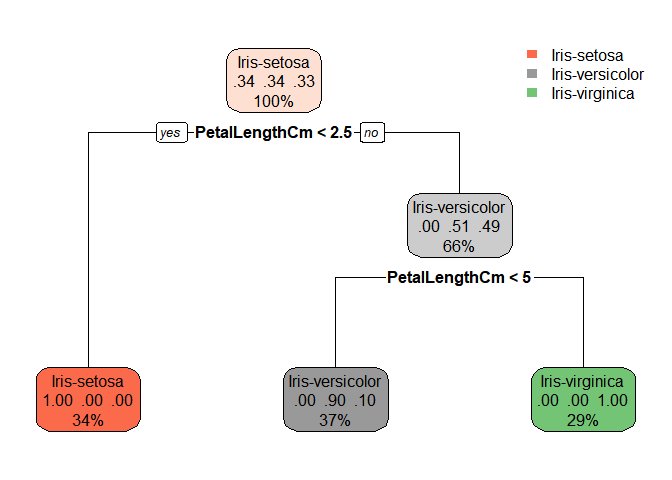

# Task : Prediction using Decision Tree Algorithm

## Importing the Iris dataset

``` r
myData <- read.csv("Iris.csv")
print(head(myData))
```

    ##   Id SepalLengthCm SepalWidthCm PetalLengthCm PetalWidthCm     Species
    ## 1  1           5.1          3.5           1.4          0.2 Iris-setosa
    ## 2  2           4.9          3.0           1.4          0.2 Iris-setosa
    ## 3  3           4.7          3.2           1.3          0.2 Iris-setosa
    ## 4  4           4.6          3.1           1.5          0.2 Iris-setosa
    ## 5  5           5.0          3.6           1.4          0.2 Iris-setosa
    ## 6  6           5.4          3.9           1.7          0.4 Iris-setosa

## Extracting features

``` r
f <- c("SepalLengthCm","SepalWidthCm","PetalLengthCm","PetalWidthCm","Species")
myFeatures = myData[f]
head(myFeatures)
```

    ##   SepalLengthCm SepalWidthCm PetalLengthCm PetalWidthCm     Species
    ## 1           5.1          3.5           1.4          0.2 Iris-setosa
    ## 2           4.9          3.0           1.4          0.2 Iris-setosa
    ## 3           4.7          3.2           1.3          0.2 Iris-setosa
    ## 4           4.6          3.1           1.5          0.2 Iris-setosa
    ## 5           5.0          3.6           1.4          0.2 Iris-setosa
    ## 6           5.4          3.9           1.7          0.4 Iris-setosa

## Analyzing the features

``` r
str(myFeatures)
```

    ## 'data.frame':    150 obs. of  5 variables:
    ##  $ SepalLengthCm: num  5.1 4.9 4.7 4.6 5 5.4 4.6 5 4.4 4.9 ...
    ##  $ SepalWidthCm : num  3.5 3 3.2 3.1 3.6 3.9 3.4 3.4 2.9 3.1 ...
    ##  $ PetalLengthCm: num  1.4 1.4 1.3 1.5 1.4 1.7 1.4 1.5 1.4 1.5 ...
    ##  $ PetalWidthCm : num  0.2 0.2 0.2 0.2 0.2 0.4 0.3 0.2 0.2 0.1 ...
    ##  $ Species      : Factor w/ 3 levels "Iris-setosa",..: 1 1 1 1 1 1 1 1 1 1 ...

``` r
summary(myFeatures)
```

    ##  SepalLengthCm    SepalWidthCm   PetalLengthCm    PetalWidthCm  
    ##  Min.   :4.300   Min.   :2.000   Min.   :1.000   Min.   :0.100  
    ##  1st Qu.:5.100   1st Qu.:2.800   1st Qu.:1.600   1st Qu.:0.300  
    ##  Median :5.800   Median :3.000   Median :4.350   Median :1.300  
    ##  Mean   :5.843   Mean   :3.054   Mean   :3.759   Mean   :1.199  
    ##  3rd Qu.:6.400   3rd Qu.:3.300   3rd Qu.:5.100   3rd Qu.:1.800  
    ##  Max.   :7.900   Max.   :4.400   Max.   :6.900   Max.   :2.500  
    ##             Species  
    ##  Iris-setosa    :50  
    ##  Iris-versicolor:50  
    ##  Iris-virginica :50  
    ##                      
    ##                      
    ## 

## Importing rpart and rpart.plot for decision tree

``` r
library("rpart")
library("rpart.plot")
```

## Test and train split of dataset

``` r
indexes = sample(150, 110)
iris_train = myFeatures[indexes,]
iris_test = myFeatures[-indexes,]
```

## Setting target value and inputs

``` r
target = Species ~  PetalLengthCm + SepalLengthCm + PetalWidthCm +  SepalWidthCm 
```

## Build and plot model

``` r
tree = rpart(target, data = iris_train, method = "class")
rpart.plot(tree)
```

<!-- -->

## Testing the model against test dataset

``` r
predictions = predict(tree, iris_test,type='class')
cp <-  sum(predictions == iris_test$Species)
sprintf("Correct predictions : %0.2f %%", (cp/40)*100)
```

    ## [1] "Correct predictions : 100.00 %"

``` r
table(predictions, iris_test$Species)
```

    ##                  
    ## predictions       Iris-setosa Iris-versicolor Iris-virginica
    ##   Iris-setosa              11               0              0
    ##   Iris-versicolor           0              13              0
    ##   Iris-virginica            0               0             16
