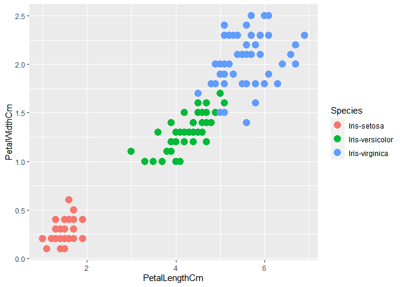
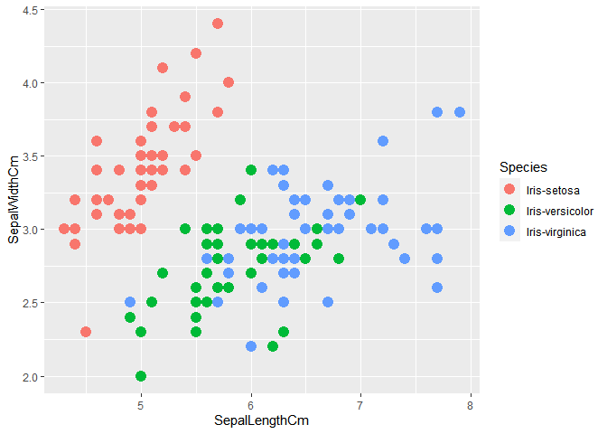
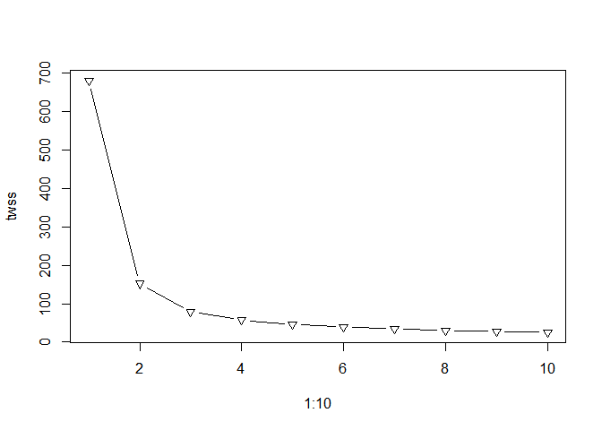
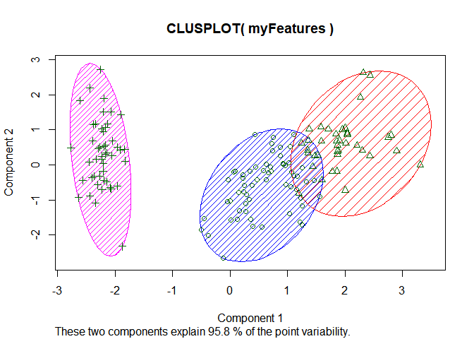

# Task : Prediction using Unsupervised ML

## Importing the Iris dataset

``` r
myData <- read.csv("Iris.csv")
print(head(myData))
```

    ##   Id SepalLengthCm SepalWidthCm PetalLengthCm PetalWidthCm     Species
    ## 1  1           5.1          3.5           1.4          0.2 Iris-setosa
    ## 2  2           4.9          3.0           1.4          0.2 Iris-setosa
    ## 3  3           4.7          3.2           1.3          0.2 Iris-setosa
    ## 4  4           4.6          3.1           1.5          0.2 Iris-setosa
    ## 5  5           5.0          3.6           1.4          0.2 Iris-setosa
    ## 6  6           5.4          3.9           1.7          0.4 Iris-setosa

## Extracting features

``` r
f <- c("SepalLengthCm","SepalWidthCm","PetalLengthCm","PetalWidthCm")
myFeatures = myData[f]
head(myFeatures)
```

    ##   SepalLengthCm SepalWidthCm PetalLengthCm PetalWidthCm
    ## 1           5.1          3.5           1.4          0.2
    ## 2           4.9          3.0           1.4          0.2
    ## 3           4.7          3.2           1.3          0.2
    ## 4           4.6          3.1           1.5          0.2
    ## 5           5.0          3.6           1.4          0.2
    ## 6           5.4          3.9           1.7          0.4

## Analyzing the features

``` r
summary(myFeatures)
```

    ##  SepalLengthCm    SepalWidthCm   PetalLengthCm    PetalWidthCm  
    ##  Min.   :4.300   Min.   :2.000   Min.   :1.000   Min.   :0.100  
    ##  1st Qu.:5.100   1st Qu.:2.800   1st Qu.:1.600   1st Qu.:0.300  
    ##  Median :5.800   Median :3.000   Median :4.350   Median :1.300  
    ##  Mean   :5.843   Mean   :3.054   Mean   :3.759   Mean   :1.199  
    ##  3rd Qu.:6.400   3rd Qu.:3.300   3rd Qu.:5.100   3rd Qu.:1.800  
    ##  Max.   :7.900   Max.   :4.400   Max.   :6.900   Max.   :2.500

## Importing ***ggplot(Grammar of Graphics)*** library for graph

``` r
library(ggplot2)
```

## Plotting graph between PetalLengthCm and PetalWidthCm

``` r
ggplot(myData, aes(PetalLengthCm, PetalWidthCm)) + geom_point(aes(col=Species), size=4)
```

<!-- -->

## Plotting graph between SepalLengthCm and SepalWidthCm

``` r
ggplot(myData, aes(SepalLengthCm, SepalWidthCm)) + geom_point(aes(col=Species), size=4)
```

<!-- -->

## Finding optimal numbers of cluster

``` r
twss <- vector(mode="character", length=10)
for (i in 1:10){
  clusters <- kmeans(myFeatures, center=i, nstart=20)
  twss[i] <- clusters$tot.withinss
}
plot(1:10, twss, type="b", pch=6)
```

<!-- -->

> We can here clearly observe that *twss value* has significant decline
> between ***k = 2*** and ***k = 3***. Later, this decline in twss is
> not much.
> 
> Hence, we get the **optimal numbers of cluster = 3**

## Importing the Cluster Library for cluster plotting

``` r
library(cluster)
```

## Plotting the clusters

``` r
clusters <- kmeans(myFeatures, center=3, nstart=20)
clusplot(myFeatures, clusters$cluster, color=T, shade=T, labels=0, lines=0)
```

<!-- -->
